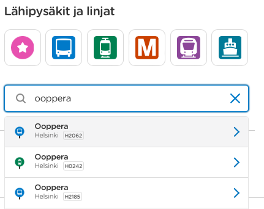

# api keys
https://portal-dev-api.digitransit.fi/profile

# dev api post and testing
https://portal-dev-api.digitransit.fi/api-details#api=routing&operation=hsl-graphql-post

# how to use graphql
https://digitransit.fi/en/developers/apis/1-routing-api/0-graphql/

# useful bits

### How to find HSL stop IDs
All stops have a unique ID, e.g. checking https://www.hsl.fi for `Ooppera` the first stop has ID `H2062`: 


## Makkyla train station real-time schedule
e.g. for manual verification
https://reittiopas.hsl.fi/pysakit/HSL%3A2118501?locale=en#E1171

## Train stations
Makkyla  to Leppavaara - HSL code: `E1171`, `gtfsId=HSL:2118501`
Makkyla to Helsinki - HSL code: `E1171`, `gtfsId=HSL:2118551`

## Example query in GraphiQL

From https://digitransit.fi/en/developers/apis/1-routing-api/stops/#query-scheduled-departure-and-arrival-times-of-a-stop

```
{
  stop(id: "HSL:2118501") {
    name
    stoptimesWithoutPatterns {
      scheduledArrival
      realtimeArrival
      arrivalDelay
      scheduledDeparture
      realtimeDeparture
      departureDelay
      realtime
      realtimeState
      serviceDay
      headsign
    }
  }
}
```
returns
```
HTTP/1.1 200 OK

content-encoding: gzip
content-type: application/json
date: Sat, 18 Nov 2023 09:25:06 GMT

{
    "data": {
        "stop": {
            "name": "Mäkkylä",
            "stoptimesWithoutPatterns": [{
                "scheduledArrival": 42360,
                "realtimeArrival": 42360,
                "arrivalDelay": 0,
                "scheduledDeparture": 42360,
                "realtimeDeparture": 42360,
                "departureDelay": 0,
                "realtime": false,
                "realtimeState": "SCHEDULED",
                "serviceDay": 1700258400,
                "headsign": "Leppävaara"
            },
```
